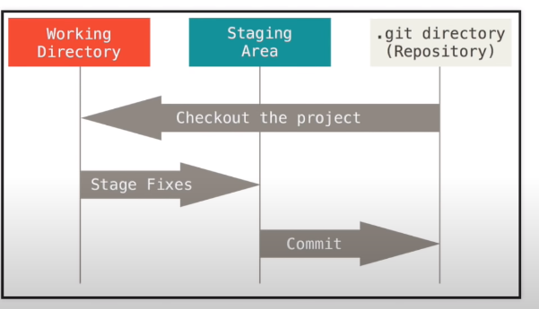

# Git

```sh
/ # which git
/usr/bin/git
/ # git --version
git version 2.40.1
/ # git config --global user.name "Pon Jagannath"
/ # 
```

```
/ # git config --global user.email = "ponskillhub@gmail.com"
```

```
/ # git config --global user.email "ponskillhub@gmail.com"
```

```
root@09ae4c2009ae:/# git config --list
user.name=Pon Jagannath
user.email==
```

### initialize git on a existing code

```
git init
```

### stop git from tracking a directory

```
rm -rf .git
```

### track status

```
git status
```

### git ignore

```
vi .gitignore
```

```
*.java
*.project
```



```
git status
```

### Add files to staging area

```
git add .gitignore
```

```
git add -A
```

### Remove a file from staging area

```
git reset .gitignore
```

### remove all files from staging area

```
git reset
```

### Commit code

```
git commit -m "Initial Commit"
```

### git log

```
root@09ae4c2009ae:/Local-Repo# git log
commit 92cd9f9dbaa8ab692f63bd04d3c3b3f910cbd2b1 (HEAD -> master)
Author: Pon Jagannath <=>
Date:   Sat Jun 3 04:40:33 2023 +0000

    Initial Commit
```

