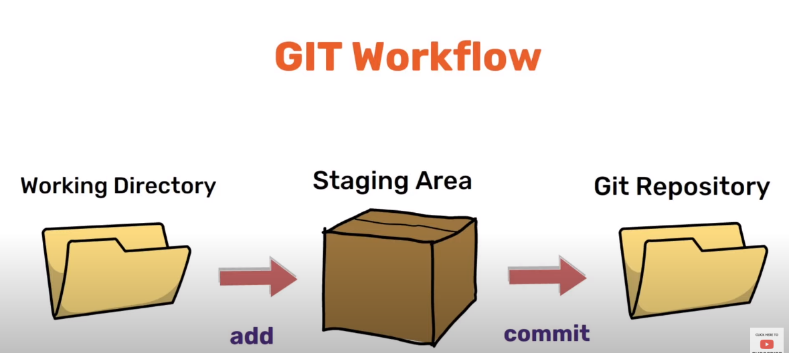

https://www.youtube.com/watch?v=kY5HtrkjSj0

### version of git

```
git --version
```

### Configure git

```
git config --global user.name = "PonJagannath"
git config --global user.email "ponskillhub@gmail.com"
```

### initialize a git repo

```
git init
```

### git status

```
git status
```

### git workflow



### to see files in staging area (or) files already commited

```
git ls-files
```

### add file to the staging area

```
git add test.txt
```

### to remove a file from staging area

```
git rm --cached test2.txt
```

### add all files in working directory to the staging area

```
git add .
```

### commit

```
git commit -m "Added two new dummy files"
```

### commit history

```
git log
```

### HEAD -> master
it points to the current commit


### print the log in a single line

```
git log --oneline
```

### check the branch in the repo

```
git branch
```

### create a new branch

```
git branch clock
```

### check which is the current branch

```
root@09ae4c2009ae://digital_clock# git status
On branch master
nothing to commit, working tree clean
```

### this shows that both master and clock branch has the same commit

```
root@09ae4c2009ae://digital_clock# git log --oneline
721c83c (HEAD -> master, clock) removed the second line
312ce95 added a welcome message
64e979a added a new digitalclock program
ddb6af4 second
fb1510d Added two new dummy files
```

### switch to the clock branch

```
git switch clock
```

```
root@09ae4c2009ae://digital_clock# git status
On branch clock
nothing to commit, working tree clean
```

```
root@09ae4c2009ae://digital_clock# git log --oneline
721c83c (HEAD -> clock, master) removed the second line
312ce95 added a welcome message
64e979a added a new digitalclock program
ddb6af4 second
fb1510d Added two new dummy files
```

### add new line in clock branch and then commit

```
root@09ae4c2009ae://digital_clock# git log --oneline
23d9736 (HEAD -> clock) added third line
721c83c (master) removed the second line
312ce95 added a welcome message
64e979a added a new digitalclock program
ddb6af4 second
fb1510d Added two new dummy files
```

### merge

```
git switch master
```

```
root@09ae4c2009ae://digital_clock# git merge clock
Updating 721c83c..23d9736
Fast-forward
 digitalclock.py | 1 +
 1 file changed, 1 insertion(+)
 ```


